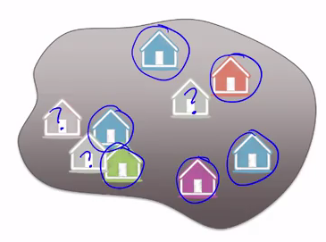
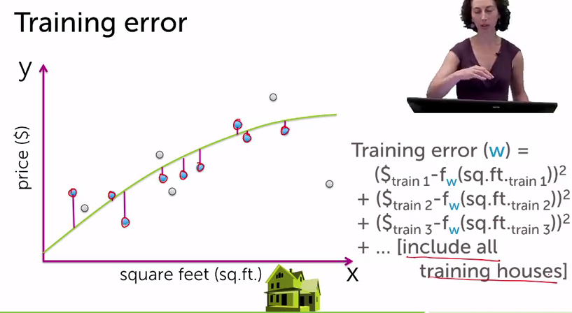
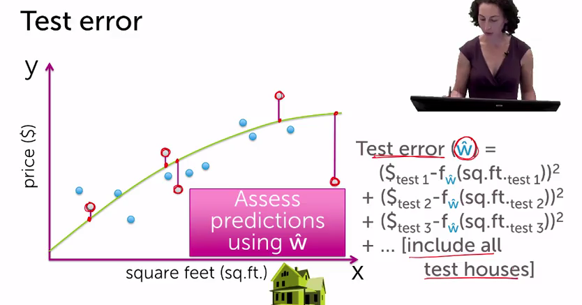
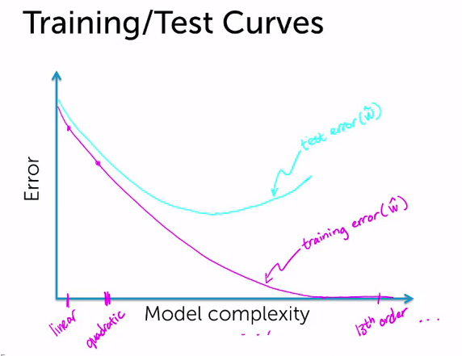
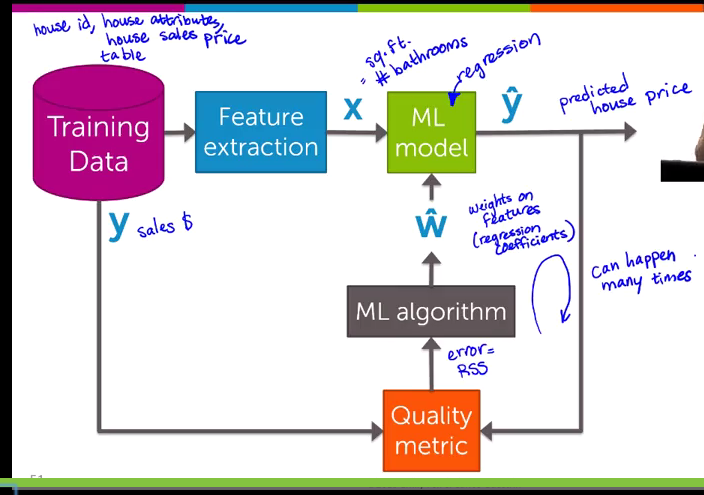
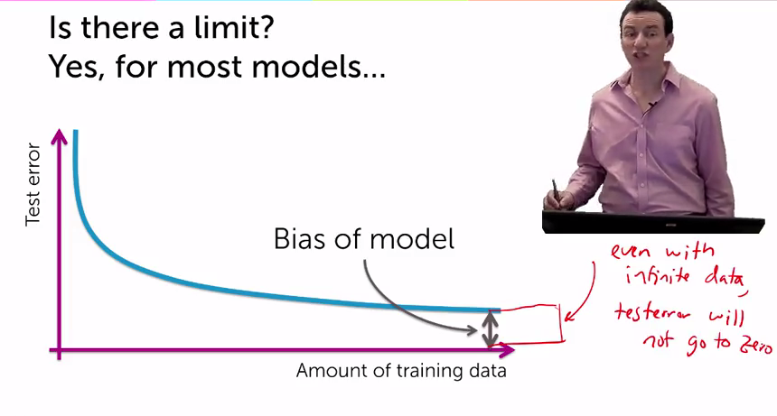
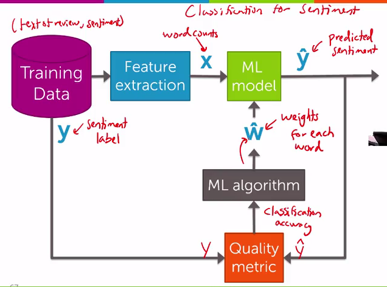
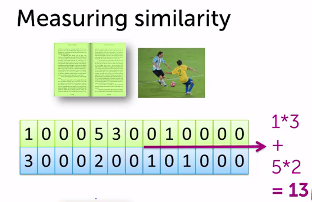
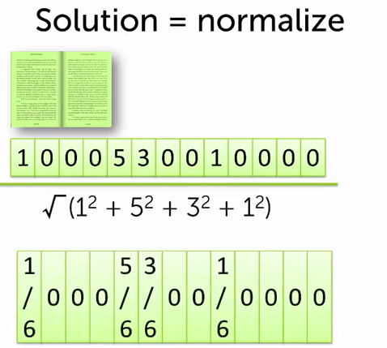

#Machine Learning Foundations

#Abstract
My notes during the Machine Learning Foundation class at coursera.org

#Week 1 and 2: Regression Model: Predicting House Prices

#Regression Models
The idea is that we have an observation value that is associated to a set of features, so we want to model how our observation value varies when we change the values of the features.

For example, we can model how a house value price varies (the observation) as a function of the house features (size, number of bathrooms and bedrooms, location, etc)

Others applications of regression are:
Classification: for example, we can use a regression model in other to classify emails as spam or not spam

##Some Terminology
In a regression model the X variable that is plotted in the X axis is called the predictor, or the covariate, or the feature or the independent variable
And Y is the observation or the dependent variable 

##Linear Regression Model

Adding a higher order effects

For example using a quadratic function

How to choose the model order/complexity

- Simulate predictions
	1) Remove some houses from the data we have
	2) Fit model on remaining
	3) Predict heldout houses
	

Houses that we use to fit our model, we call it the training set
Houses that we use as a proxy for a prediction, those that we hold out, we call that the test set

So, the training error is the RSS of the training dataset

So, we look at the parameters or features that minimize our training error

The test error is the RSS for the observations that are in our test dataset

As we increase the order of the model the training error tents to decrease and approximate to zero. However, at some point the predictions will be poor even if the training error is very small.

When we apply our model to the test dataset, and as we increase the order of the model, the test error will decrease improving the quality of the prediction. However at some point or at some model order, the test error will start to increase, deteriorating the quality of the prediction.

##Machine Learning - Regression Model Blocks Diagram

#Week 3: Classification: Analyzing Sentiment

##What makes good a classification system?

- Is there class imbalance?
- How does it compare to a simple baseline approach?
	- Random guessing
	- Majority class
- Most importantly:
	- What is good enough for my user experience?
	- What is the impact of the mistake we make?
	
##Types of mistakes in a classification system

###The Confusion Matrix

- True label is + and the predicted label is + = **True Pasitive**
- True label is + and the predicted label is - = **False Negative**
- True label is - and the predicted label is + = **False Positive**
- True label is - and the predicted label is - = **True Negative**

##The Learning Curve

The more data (good quality data) we have for the training model, the smaller the test error should be. However the test error will never be zero.

To this fact that the test error will never be zero, we call it: **Bias of model**

##Class Probability
In most cases, instead of only predict if an observation belongs to a certain class, we are going to assign a **probability** that the observation belongs to a certain class.

We use the following notation:

	P(Y|X) **Probability of Y given X

For example. In a sentiment sentences classification system:

- The food was **awful** 	P(Y = - | X) = 0.99 (99%)
- The food was **OK**    	P(Y = - | X) = 0.54 (54%)

In the example, Y is the predicted label (positive or negative), and X is the sentences and its parameters, in this case, the only parameter is the word "awful" or "OK"

So, when we assign probabilities to classes, we must train our system and decide which probability boundary makes the prediction good enough.

##Block Diagram of a Classification System

The same way we built a Block Diagram for a Regression Model, we can built a similar one of a Classification System:

#Week 4: Clustering and Similarity: Retrieving Documents

##Word count document representation

###Bag of words model

- Ignore the order of words
- Count # of instances of each word in vocabulary

This method counts the number of times each word in the vocabulary appears in the text of the document.
Then, to compare one document to another, it multiplies each amount of each word in the vocabulary between
documents and sums the total. The more similar are both documents the higher is the total sum.

####Issues of the bag of words model
The main issue with this model, is that if we double the length of the documents we are comparing, the 
sum of the words instances will be much higher, so we can wrongly conclude that the documents are more
similar than in the case of shorter documents, even though they are still of the same "similarity".

To address this issue, we take the normalized version of the words count vector, taking the root square
of the sum of the power of two of the words instances:

