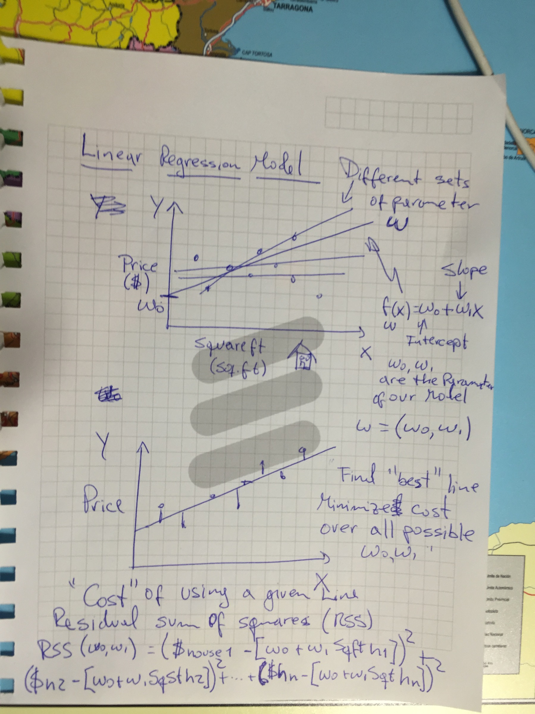
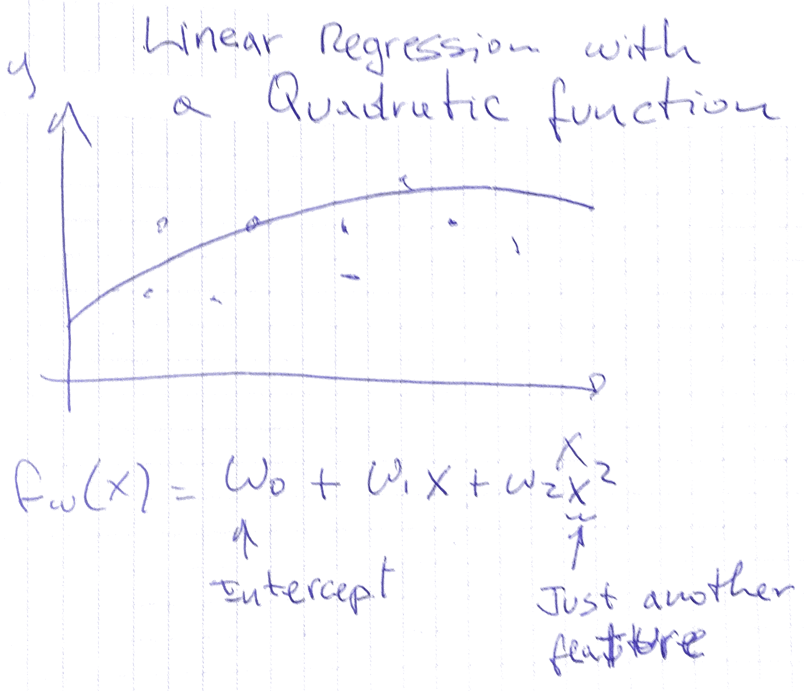

#Machine Learning Foundations

#Abstract
My notes during the Machine Learning Foundation class at coursera.org

#Week 1 and 2

#Regression Models
The idea is that we have an observation value that is associated to a set of features, so we want to model how our observation value varies when we change the values of the features.

For example, we can model how a house value price varies (the observation) as a function of the house features (size, number of bathrooms and bedrooms, location, etc)

Others applications of regression are:
Classification: for example, we can use a regression model in other to classify emails as spam or not spam

##Some Terminology
In a regression model the X variable that is plotted in the X axis is called the predictor, or the covariate, or the feature or the independent variable
And Y is the observation or the dependent variable 

##Linear Regression Model

Adding a higher order effects

For example using a quadratic function

